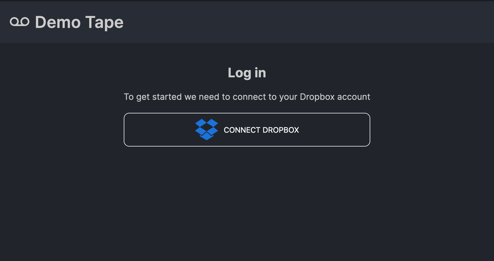
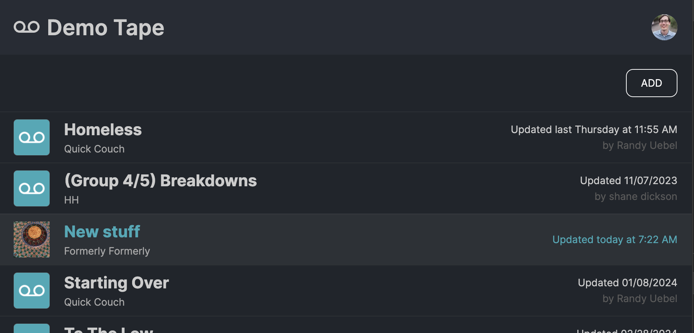
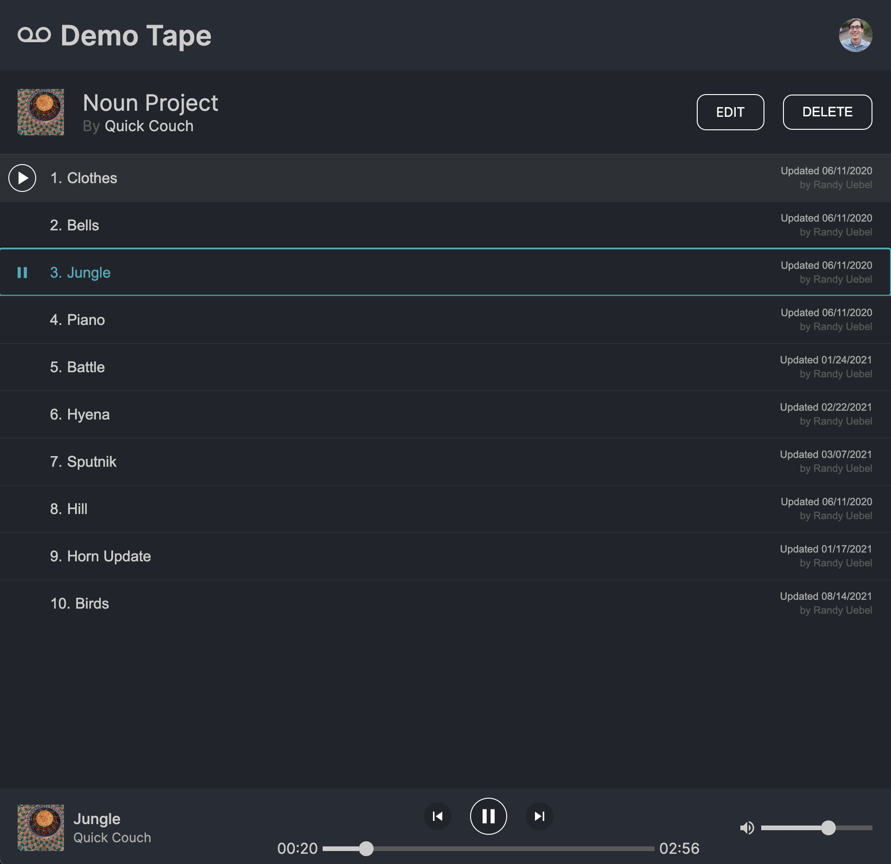
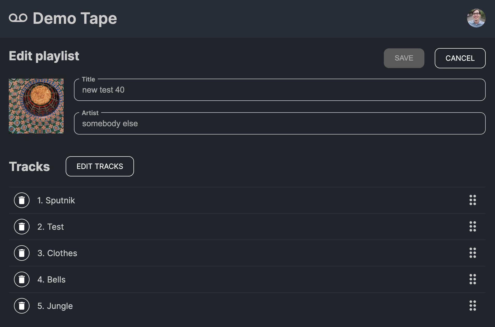
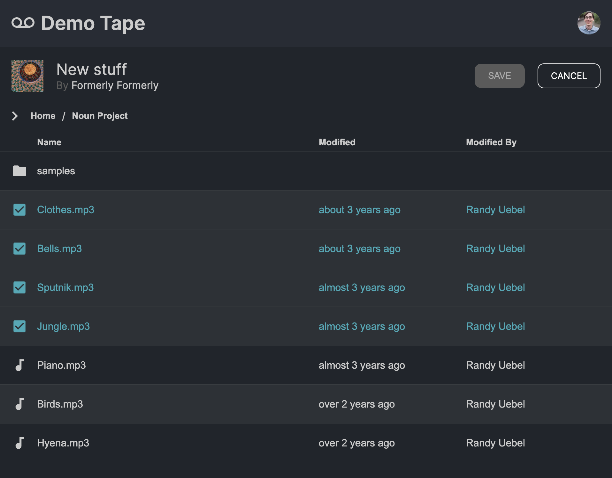

# Dropbox Demo Tape

> A collaborative playlist app built on Dropbox

https://dropbox-demo-tape.vercel.app/

## Overview

- Create and listen to collaborative playlists in Dropbox
- Anyone with permissions to the file in Dropbox can collaborate

### Login

Log in to Dropbox to start



### Playlists

- View all of the playlists you have access to
- Playlists are saved as `.mix` files in Dropbox
- Playlists can be shared with friends by giving them access to your `.mix` files



### Listen to your Playlists



### Edit Playlist

Edit playlist details.



Select tracks from Dropbox.

_You won't need to reselect the tracks when you upload new versions as long as the file name stays the same._



## Technology

- [React](https://react.dev/)
- [Typescript](https://www.typescriptlang.org/)
- [Jotai](https://jotai.org/)
- [NextJS](https://nextjs.org/)
- [Vercel](https://vercel.com/)

## Development

To install dependencies

```console
npm install
```

To run locally

```console
npm run dev
```

### Dropbox Client Id

You will need a dropbox client id

1. [Create an app](https://www.dropbox.com/developers/apps?)
2. Add `{your_deployment_url}/auth` to the `Redirct URIs`
3. Copy the App key and update the key in `./constants.ts`
